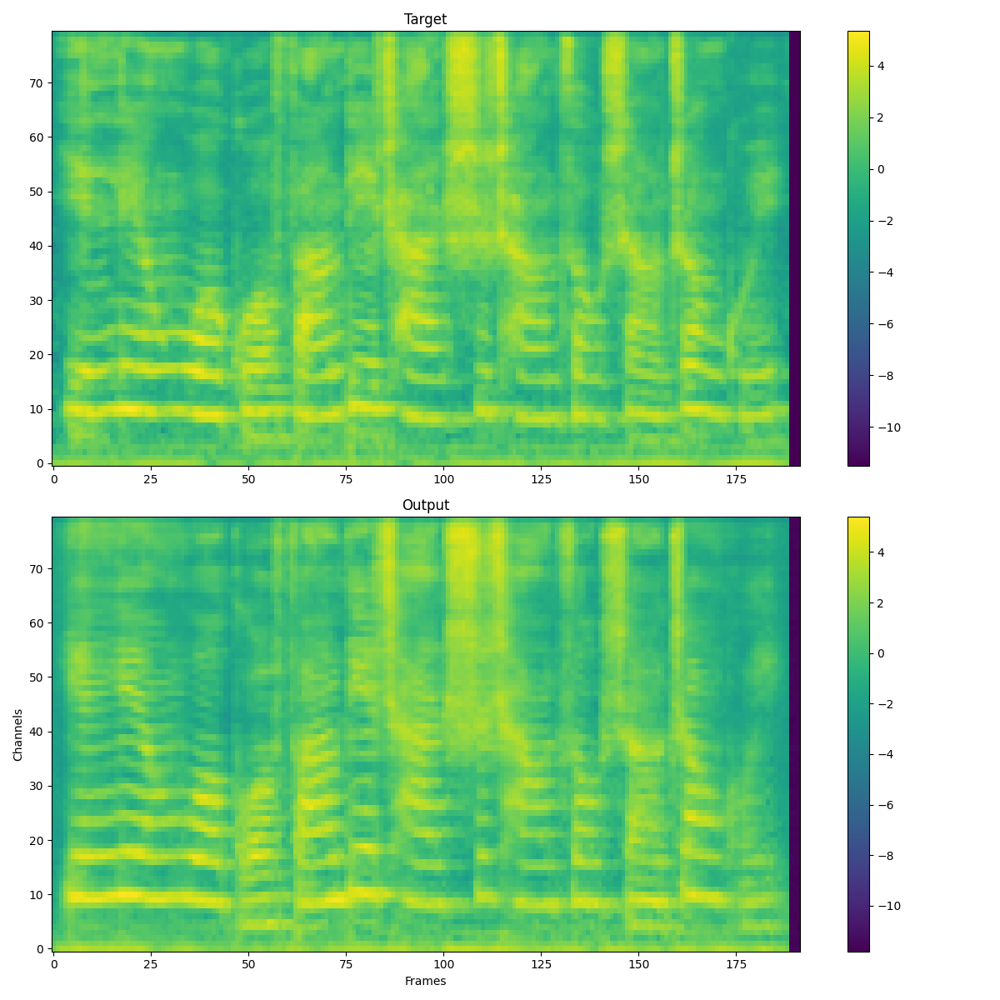

# megatts2
Unofficial implementation of Megatts2

## TODO
- [x] Prepare dataset
- [x] VQ-GAN
- [x] ADM
- [x] PLM

## Requirements
- python=3.10
- lightning
- lhotse
- transformers
- pypinyin
- WeTextProcessing
- phonemizer

## Install mfa
1. conda create -n aligner && conda activate aligner
2. conda install -c conda-forge montreal-forced-aligner=2.2.17

## Prepare dataset
1. Prepare wav and txt files to ./data/wav 
2. Run `python3 prepare_ds.py --stage 0 --num_workers 4 --wavtxt_path data/wavs --text_grid_path data/textgrids --ds_path data/ds`
3. mfa model download acoustic mandarin_mfa
4. mfa align data/wavs utils/mandarin_pinyin_to_mfa_lty.dict mandarin_mfa data/textgrids --clean -j 12 -t /workspace/tmp
5. Run `python3 prepare_ds.py --stage 1 --num_workers 4 --wavtxt_path data/wavs --text_grid_path data/textgrids --ds_path data/ds` 
6. Run `python3 prepare_ds.py --stage 2 --generator_config configs/config_gan.yaml --generator_ckpt generator.ckpt` after training generator.

## Train
Training procedure refers to Pytorch-lightning

## Reconstructed mel-spectrogram
### 400k steps on aishell dataset train by 4090
 

## License
- MIT
- Support by Simon of [ZideAI](https://zideai.com/)
